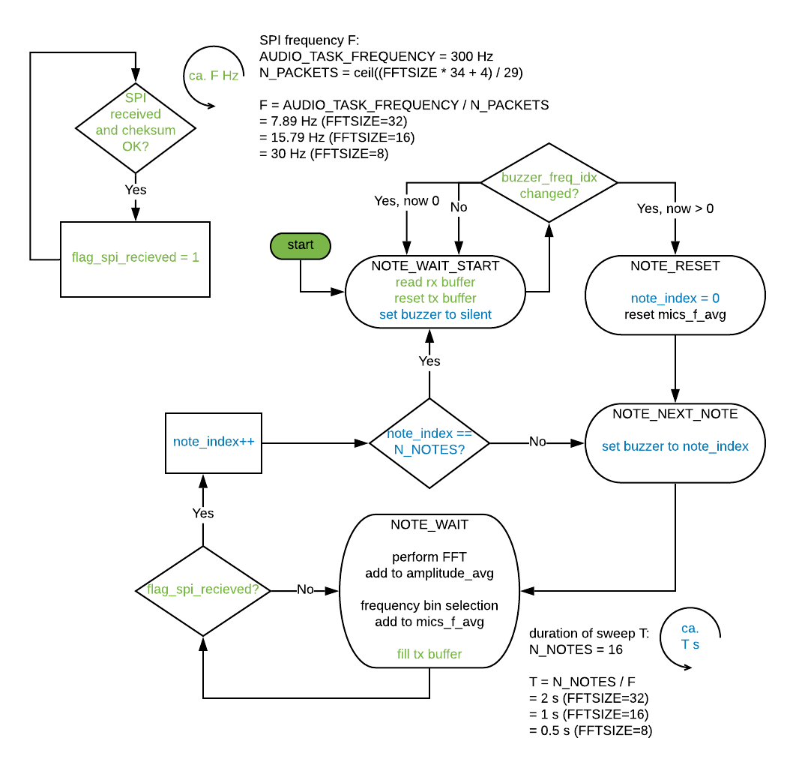
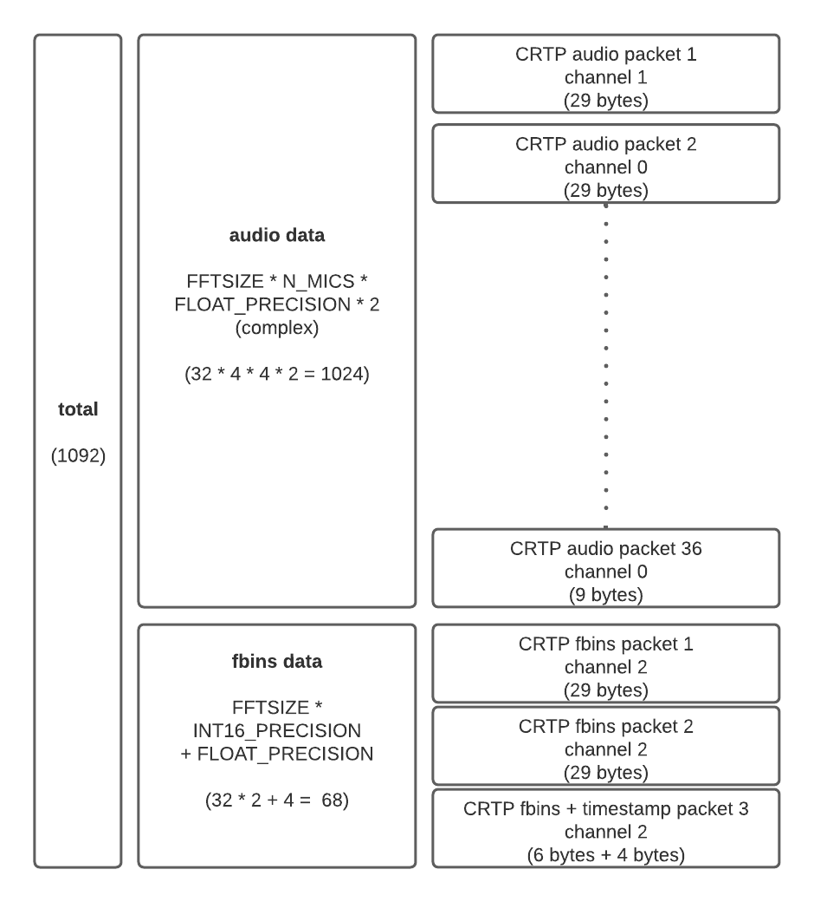

# Explanation of firmware

## Firmware of audio deck 

The state machine running on the audio deck firmware is shown below. 

## Crazyflie audio deck driver

The CRTP messages to exchange audio data between the audio-deck driver and the ground station is shown below. 

