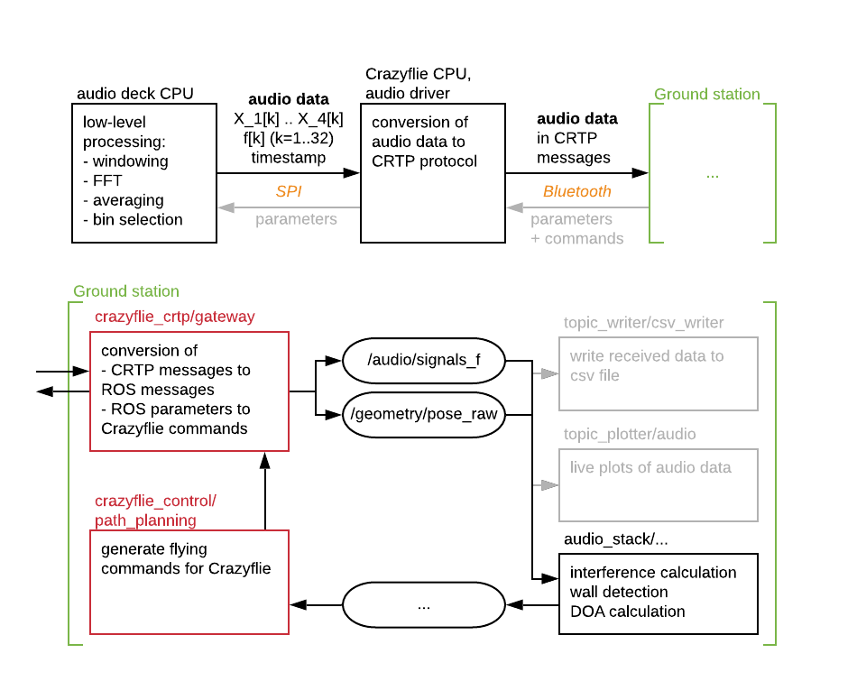

# How to add new robotic platforms to audioROS

Because of the modular design, it is straight forward to integrate new robotic platforms to the audioROS framework. 
The main requirements to add a different platform are 
- Sound can be recorded on the platform using one or more microphones.
- The platform is equipped with an IMU or more sophisticated motion tracking system to give relative movement estimates.
- The audio data can be sent to the laptop in real-time. Since usually the bandwidth is too small to send the full audio signals, an FFT has to be performed onboard and only a small number of frequency bins is sent (more details below in)

Depending on the use case, additional requirements are needed:
- For DOA, the microphone measurements should be accompanied by an exact (ideally micro-second resolution) timestamp. 
- For Wall detection, a small speaker or buzzer that can produce single-frequency sounds should be included.

A simplified version of the processing pipeline for the Crazyflie drone is shown in the figure below. The ROS components that need to be reimplemented for each new platform are marked in red. The top row shows the hardware pipeline specific to the Crazyflie platform, which is to be replaced with the desired robotic platform.

## ROS programming

As shown in the Figure above, the input to the audio-based algorithms are a the `audio/signals_f` and `geometry/pose_raw` messages. The user thus needs to create one or multiple ROS nodes which converts the audio and motion data received from the robotic platform to these custom ROS messages. 

In the current implementation, this is done through the [`crazyflie_crtp/gateway.py`](https://github.com/LCAV/audioROS/blob/master/src/crazyflie_crtp/crazyflie_crtp/gateway.py) node, which fills buffers as the CRTP messages come in, and creates and publishes the ROS messages at a fixed rate. Each buffer is only sent once, so the publishing rate is set very high to minimize the waiting time between filling the buffer and publishing the corresponding ROS message. 
The motion data is received through the Crazyflie's logging framework, which also works through CRTP protocol. Data is received at a fixed rate, and each time a new message arrives, it is immedialtely converted to a ROS message. 

Note that you might need to create a new [`crazyflie_description_py/parameters.py`](https://github.com/LCAV/audioROS/blob/master/src/crazyflie_description/crazyflie_description_py/parameters.py) file according to your robotic platform, containing the correct geometry etc. 

## Hardware programming

It is hard to give general instructions for the hardware part as the robotic platforms may differ a lot in terms of their implementation. Below are a few recommendations based on our own experience. 

- If you are using the Crazyflie drone with your own microphone deck: rather than implementing your own pipeline for CRTP to ROS conversion, you can reuse the [ReaderCRTP](https://github.com/LCAV/crazyflie-audio/blob/master/python/reader_crtp.py) class, as long as you adjust the parameters for the number of frequency bins sent, number of mics, etc.

- If you are using a different robotic platform, you can either send the raw audio data, in which case you want to run the `processor` node to perform the FFT, or you perform the FFT onboard and send only a certain number of frequency bins. We only have experience with the latter option, so this is the recommended one. It also puts a lower load on the communication and is less prone to package loss.

- You can adjust the buffer size (`N_BUFFER`) and sampling frequency (`FS`) in [`crazyflie_description_py/parameters.py`](https://github.com/LCAV/audioROS/blob/master/src/crazyflie_description/crazyflie_description_py/parameters.py), but we recommend to use the provided values (2048 and 32kHz, respectively). 

## Questions and comments

Please let us know if you are implementing the above on your own robotic platform, we are happy to give some advice! Once you have successfully integrated your own platform, feel free to add your code to the repo through a pull request. 
